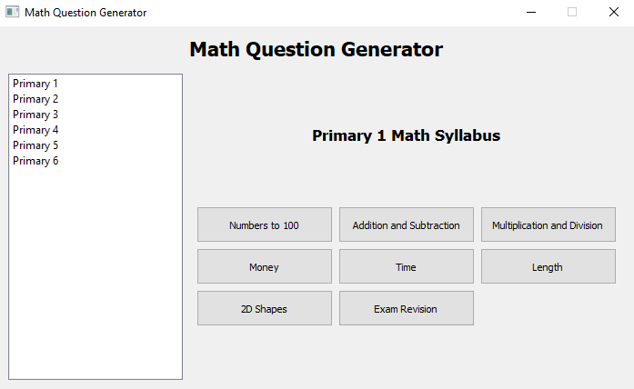
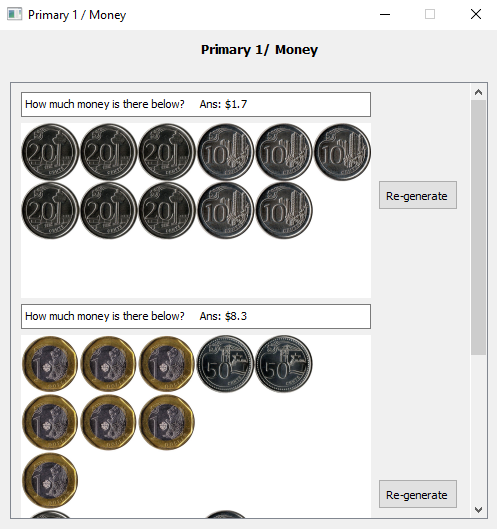

<h1> Mathematics Assessment Book for Pri School </h1>
The Singapore-oriented Primary School Math Assessment Book aims to provide unlimited automatically generated questions for Primary School Students.

You can [see the repositiory](https://github.com/porkboi/math-assess-book), and start using it for free today.

<h2> Features </h2>
<b>1. For teachers and students alike!</b>

Automating Homework generation and grinding for exams!

<b>2. Unlimited questions!</b>

Generating questions basedon reverse-engineered methods allow for unlimited questions which will always be solvable to be generated.

<h2> Pipeline </h2>
<h3> Main File </h3>
stackedwindows.py aims to generate the GUI application, leveraging on functions from imagegen.py and questiongen.py
Utiises PyQt5, Pillows and Random

<h3> Image generation </h3>
Utilises Pillows to make image mosiacs

<h3> Question Generation </h3>
Function Database population in the event of future extensions to Django

<h2> Question Completion </h2>
As of now, the following are operational:

<h3> Primary 1 Window (DONE) </h3>

Unit 1/ Numbers to 100 (Functional)

Unit 2/ Addition and Substraction (Functional)

Unit 3/ Multiplication and Division (Functional)

Unit 4/ Money (Functional)

Unit 5/ Time (Functional)

<h3> Primary 2 Window (DONE) </h3>
